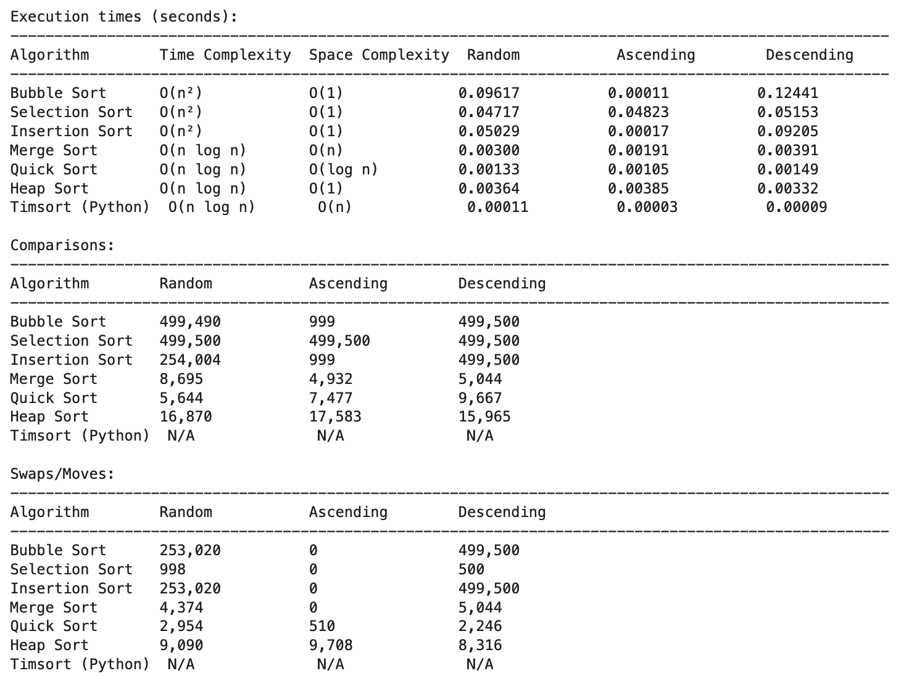
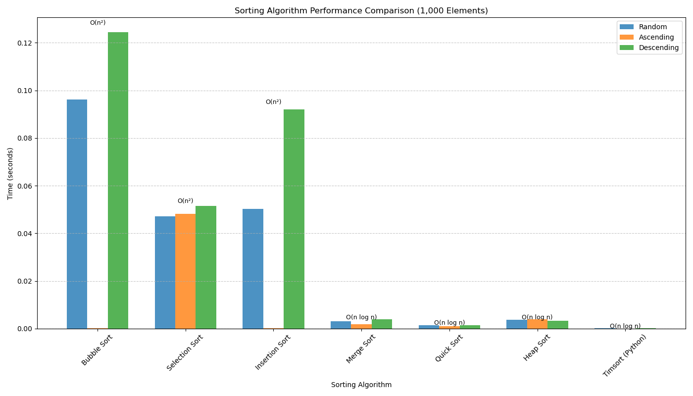
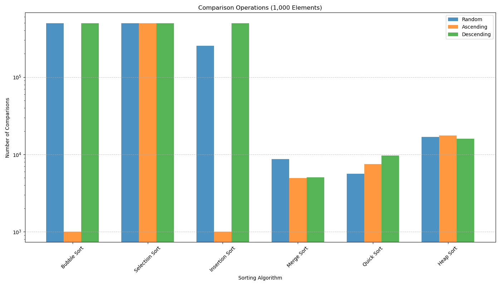
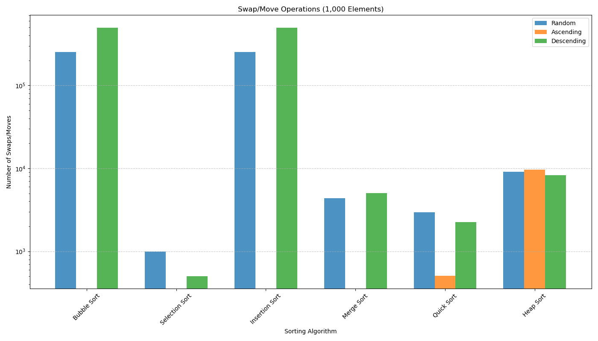

# Sorting Algorithm Benchmarking and Visualization

## Project Description

A comprehensive Python Code for benchmarking and comparing the performance of various sorting algorithms. This project allows users to evaluate the efficiency of different sorting methods across various data distributions and sizes, visualize the results, and understand the theoretical and practical differences between algorithms.

## Table of Contents

- [Installation](#installation)
- [Usage](#usage)
- [Features](#features)
- [Methodology](#methodology)
- [Examples](#examples)
- [References](#references)
- [Dependencies](#dependencies)
- [Algorithms/Mathematical Concepts Used](#algorithmsmathematical-concepts-used)
- [License](#license)
- [Acknowledgments](#acknowledgments)
- [Note](#note)

---

## Installation

To set up the Sorting Algorithm Benchmark project, follow these steps:

- Install the required dependencies:
   ```bash
   pip install numpy matplotlib timeit argparse warnings os abc heapq
   ```

## Usage

The benchmarking and visualization tool can run in interactive mode in Jupyter Notebook.

### Interactive Mode
    - Simply run the cell.
    - Follow the prompts to configure the benchmark parameters.

## Features

- **Multiple Sorting Algorithms**: Implements seven classic sorting algorithms with proper complexity annotations
- **Performance Metrics**: Measures execution time, comparison counts, and swap operations
- **Various Data Distributions**: Tests algorithms on random, ascending, descending, and partially sorted data
- **Visualization Tools**: Generates bar charts for comparing algorithm performance
- **Detailed Analysis**: Provides comprehensive tables of results with complexity information
- **Flexible Configuration**: Supports command-line arguments and interactive mode
- **Error Handling**: Includes validation, warnings for large datasets, and proper error reporting

## Methodology

The benchmarking process follows these key steps:

1. **Algorithm Implementation**:
   - Each sorting algorithm is implemented as a class derived from the abstract `SortingAlgorithm` base class
   - Algorithms track comparison and swap operations during execution

2. **Dataset Generation**:
   - Creates datasets of specified size with different distributions:
     - Random: Completely unsorted data
     - Ascending: Pre-sorted in ascending order
     - Descending: Pre-sorted in descending order
     - Partially Sorted: Partially pre-sorted data (70% sorted)

3. **Benchmarking Process**:
   - For each algorithm and dataset combination:
     - Measures execution time using Python's `timeit` module
     - Counts comparison and swap operations
     - Skips excessively slow combinations (e.g., quadratic algorithms on large random datasets)

4. **Results Analysis**:
   - Generates tables showing execution times, comparison counts, and swap operations
   - Creates bar charts comparing algorithm performance across different datasets
   - Provides logarithmic scale option for better visualization of performance differences

5. **Visualization**:
   - Produces time comparison charts
   - Generates operation count visualizations
   - Adds complexity annotations for reference

## Examples

When run with a dataset size of 1000 elements, the benchmark and visualization will produce results similar to:

### Benchmarking Example:



### Visualization Examples:

- Time Comparison Chart: Shows execution times across different algorithms and datasets

- Comparison Operations Chart: Displays the number of comparisons performed by each algorithm

- Swap Operations Chart: Illustrates the number of element swaps/moves performed


## References

1. Cormen, T. H., Leiserson, C. E., Rivest, R. L., & Stein, C. (2009). *Introduction to Algorithms* (3rd ed.). MIT Press.
2. Knuth, D. E. (1998). *The Art of Computer Programming, Volume 3: Sorting and Searching* (2nd ed.). Addison-Wesley.
3. Sedgewick, R., & Wayne, K. (2011). *Algorithms* (4th ed.). Addison-Wesley.
4. McIlroy, P. D., Bostic, K., & McIlroy, M. D. (1993). Engineering radix sort. *Computing Systems*, 6(1), 5-27.

## Dependencies

- **Python 3.6+**: Core language
- **NumPy**: For efficient array operations and random number generation
- **Matplotlib**: For visualization and chart generation
- **Standard Library Modules**: argparse, timeit, warnings, os, abc, heapq

## Algorithms/Mathematical Concepts Used

This project implements and analyzes the following sorting algorithms:

1. **Bubble Sort**
   - Time Complexity: O(n²)
   - Space Complexity: O(1)
   - Mathematical Basis: Repeated pairwise comparison and swapping
   - Optimization: Early termination when no swaps occur in a pass

2. **Selection Sort**
   - Time Complexity: O(n²)
   - Space Complexity: O(1)
   - Mathematical Basis: Finding the minimum element in unsorted portion and moving it to the sorted portion

3. **Insertion Sort**
   - Time Complexity: O(n²)
   - Space Complexity: O(1)
   - Mathematical Basis: Building a sorted array one item at a time
   - Best case: O(n) for nearly sorted data

4. **Merge Sort**
   - Time Complexity: O(n log n)
   - Space Complexity: O(n)
   - Mathematical Basis: Divide and conquer, recursive merging of sorted subarrays
   - Stable sort with guaranteed worst-case performance

5. **Quick Sort**
   - Time Complexity: O(n log n) average, O(n²) worst-case
   - Space Complexity: O(log n)
   - Mathematical Basis: Divide and conquer using partitioning
   - Optimization: Median-of-three pivot selection to avoid worst-case performance

6. **Heap Sort**
   - Time Complexity: O(n log n)
   - Space Complexity: O(1)
   - Mathematical Basis: Binary heap data structure, selection sort with efficient access to largest element
   - In-place sorting algorithm with guaranteed O(n log n) performance

7. **Timsort**
   - Time Complexity: O(n log n)
   - Space Complexity: O(n)
   - Mathematical Basis: Hybrid sorting algorithm derived from merge sort and insertion sort
   - Adaptive algorithm that exploits existing order in the data

The benchmark also explores computational complexity theory, empirical performance analysis, and algorithm efficiency visualization.

## License

This project is licensed under the MIT License - see the LICENSE file for details.

## Acknowledgments

- Inspired by classic algorithm textbooks and courses
- Developers of NumPy and Matplotlib
- Algorithm implementations based on pseudocode from various academic sources

## Note

| AI was used to generate most of the docstrings and inline comments in the code. |
|:--:|
